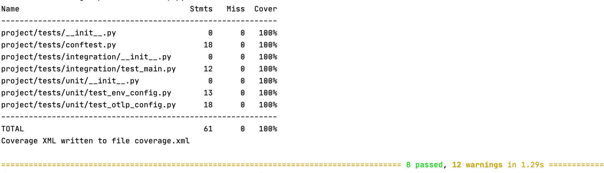
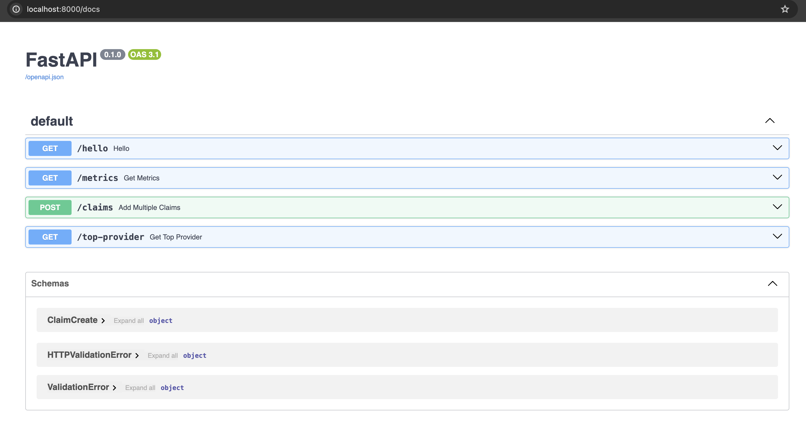
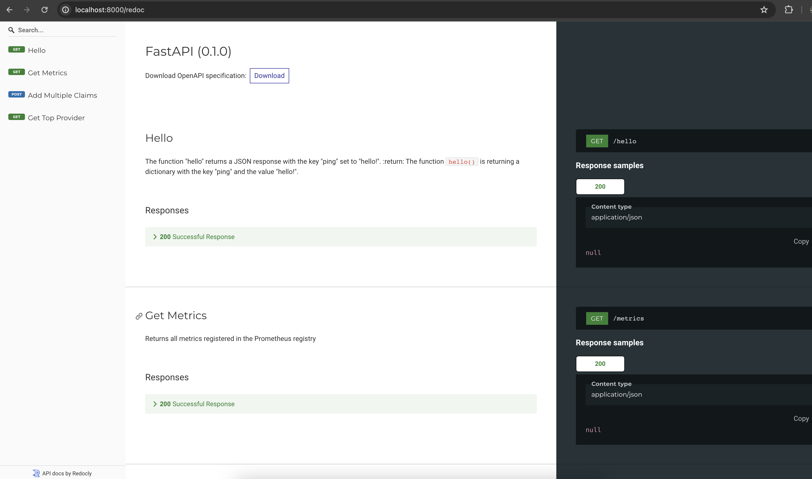
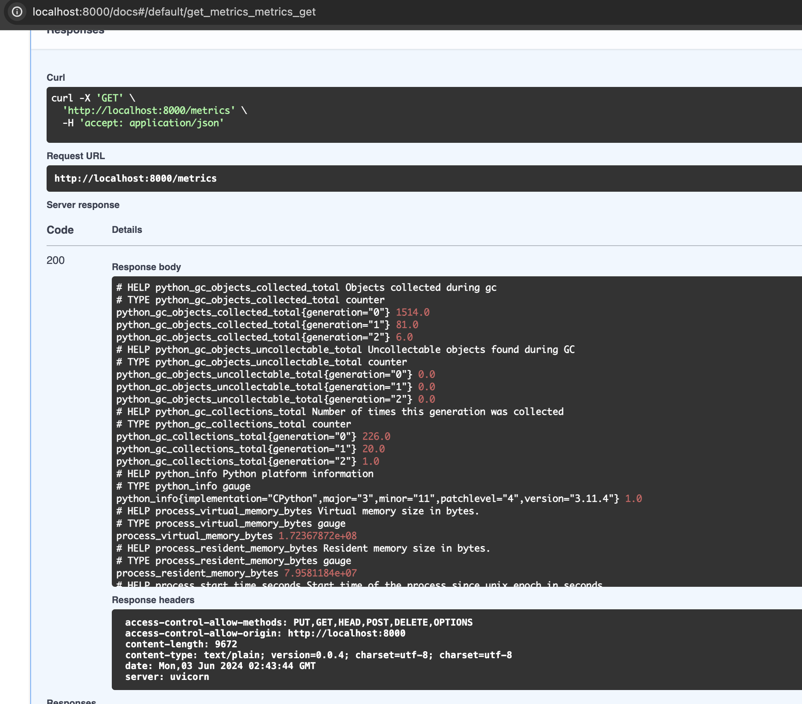
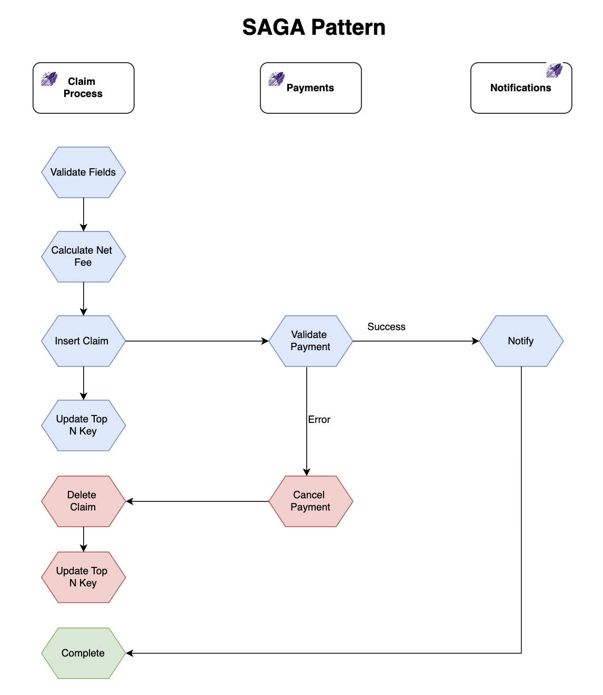

## Claims Process
This project is intended to be used for Python API projects.
1. **claim_process** transforms a JSON payload representing a single claim input with multiple lines and stores it into a RDB.
   - An example input (in CSV format) - *claim_1234.csv* is provided. Note that the names are not consistent in capitalization.
2. **claim_process** generates a unique id per claim.
3. **claim_process** computes the *“net fee”* as a result per the formula below.
*“net fee” = “provider fees” + “member coinsurance” + “member copay” - “Allowed fees”* (note again that the names are not consistent in capitalization).
4. A downstream service, **payments**, will consume *“net fee”* computed by **claim_process**.
5. Implement an endpoint that returns the top 10 provider_npis by net fees generated. The endpoint should be optimized for performance, and the you should explain the data structure and algorithm used to compute the top 10 provider_npis. It would be good to have a rate limiter to this api probably 10 req/min.


<p align="center">
  <a href="">
    
  </a>
</p>

<p align="center">
  <a href="">
      
  </a>
  <a href="https://fastapi.tiangolo.com">
      
  </a>
  <a href="https://www.postgresql.org">
      
  </a>
  <a href="https://redis.io">
      
  </a>
  <a href="https://docs.docker.com/compose/">
      
  </a>
  <a href="https://nginx.org/en/">
      
  </a>
</p>

##  About

**FastAPI boilerplate** creates an extendable async API using FastAPI, SQLModel and PostgreSQL:

- [`FastAPI`](https://fastapi.tiangolo.com): modern Python web framework for building APIs
- [`SQLModel`](https://sqlmodel.tiangolo.com): SQL databases in Python, designed for simplicity, compatibility, and robustness.
- [`PostgreSQL`](https://www.postgresql.org): The World's Most Advanced Open Source Relational Database
- [`Redis`](https://redis.io): Open source, in-memory data store used by millions as a cache, message broker and more.
- [`ARQ`](https://arq-docs.helpmanual.io) Job queues and RPC in python with asyncio and redis.
- [`Docker Compose`](https://docs.docker.com/compose/) With a single command, create and start all the services from your configuration.
- [`NGINX`](https://nginx.org/en/) High-performance low resource consumption web server used for Reverse Proxy and Load Balancing.


## Prerequisites

- Python 3.10
- create a `.env` file at the root directory with all your environment variables.

## How to run
- cd into the root project directory
- Install dependencies using the command below:
  - `pip install -r requirements.txt`

## How to run with Docker
- With a Docker instance running, run the command below:
  - `docker-compose up -d --build`

## Run unit/integration tests
- Install test dependencies
  - `pip install -r requirements-test.txt`
  
- Run the tests, this will generate a coverage report
  - `python -m pytest --cov-report=term --cov-report=xml:coverage.xml --cov=project/tests`

    

## Interactive API Docs

Now you can go to http://localhost:8000/docs (or equivalent, using your Docker host).

You will see the automatic interactive API documentation (provided by [Swagger UI](https://github.com/swagger-api/swagger-ui)):



## Alternative API docs
And you can also go to http://localhost:8000/redoc (or equivalent, using your Docker host).



You will see the alternative automatic documentation (provided by ReDoc):

# FastAPI + SQLModel + Alembic

We will work with SQLAlchemy asynchronously with SQLModel, Postgres, FastAPI and Docker. We'll also configure Alembic for handling database migrations.

## Alembic
Finally, let's add [Alembic](https://alembic.sqlalchemy.org/) into the mix to properly handle database schema changes.
Add it to the requirements file.
Take a quick look at [Using Asyncio with Alembic](https://alembic.sqlalchemy.org/en/latest/cookbook.html#using-asyncio-with-alembic) while the new images are building.

Once the containers are back up, initialize Alembic with the [async](https://github.com/sqlalchemy/alembic/tree/rel_1_11_1/alembic/templates/async) template:

`$ docker-compose exec web alembic init -t async migrations`

Within the generated "project/migrations" folder, import SQLModel into script.py.mako, a [Mako](https://www.makotemplates.org/) template file:

To generate the first migration file, run:
`$ docker-compose exec web alembic revision --autogenerate -m "init"`

Apply the migration:
`$ docker-compose exec web alembic upgrade head`

Create a new migration file:
`docker-compose exec web alembic revision --autogenerate -m "add netfee"`

## Hello World
Sanity check: [http://localhost:8000/hello](http://localhost:8000/hello)


## Add claims:

[http://localhost:8000/claims](http://localhost:8000/claims)

```sh
$ curl --location --request POST 'http://localhost:8000/claims' \
  --header 'Content-Type: application/json' \
  --data-raw '[
      {
          "service_dttm": "2018-03-20 00:00:00",
          "submitted_proc": "D0180",
          "group_id": "GRP-1000",
          "subscriber_id": "3730189502",
          "provider_npi": "1497775540",
          "provider_fees": 100.00,
          "allowed_fees": 100.00,
          "member_co_ins": 10.00,
          "member_co_pay": 0.00,
          "quadrant": null
      },
      {
          "service_dttm": "2018-03-20 00:00:00",
          "submitted_proc": "D0180",
          "group_id": "GRP-1000",
          "subscriber_id": "3730189502",
          "provider_npi": "1497775540",
          "provider_fees": 100.00,
          "allowed_fees": 100.00,
          "member_co_ins": 10.00,
          "member_co_pay": 0.00,
          "quadrant": "UR"
      }
  ]'
```

## Top N Providers:

[http://localhost:8000/top-provider](http://localhost:8000/top-provider)

```
$ curl --location --request GET 'http://localhost:8000/top-provider' \
  --data-raw ''
```

- `RateLimitException`: 429 too many requests

## Metrics

Returns all metrics registered in the Prometheus registry

[http://localhost:8000/metrics](http://localhost:8000/metrics)

```
$ curl --location --request GET 'http://localhost:8000/metrics' \
  --data-raw ''
```




## Database

```sql
CREATE TABLE public.claim (
	service_dttm timestamp NOT NULL,
	submitted_proc varchar NOT NULL,
	group_id varchar NOT NULL,
	subscriber_id varchar NOT NULL,
	provider_npi varchar(10) NOT NULL,
	provider_fees float8 NOT NULL,
	allowed_fees float8 NOT NULL,
	member_co_ins float8 NOT NULL,
	member_co_pay float8 NOT NULL,
	quadrant varchar NULL,
	id serial4 NOT NULL,
	net_fee float8 NOT NULL,
	CONSTRAINT claim_pkey PRIMARY KEY (id)
);
CREATE INDEX ix_provider_npi ON public.claim USING btree (provider_npi);
```

## Rate Limiter

[FastAPI-Limiter](https://pypi.org/project/fastapi-limiter/) is a rate limiting tool for fastapi routes with lua script.

Just install from pypi
`pip install fastapi-limiter`

FastAPI-Limiter is simple to use, which just provide a dependency RateLimiter, the following example allow 10 times request per 60 seconds in route /.

```
import redis.asyncio as redis
import uvicorn
from fastapi import Depends, FastAPI

from fastapi_limiter import FastAPILimiter
from fastapi_limiter.depends import RateLimiter

app = FastAPI()


@app.on_event("startup")
async def startup():
    redis_connection = redis.from_url("redis://localhost", encoding="utf-8", decode_responses=True)
    await FastAPILimiter.init(redis_connection)


@app.get("/", dependencies=[Depends(RateLimiter(times=10, seconds=60))])
async def index():
    return {"msg": "Hello World"}


if __name__ == "__main__":
    uvicorn.run("main:app", debug=True, reload=True)
```

## Caching

[fastapi-redis-cache](https://pypi.org/project/fastapi-redis-cache/)
Cache response data for async and non-async path operation functions.
Lifetime of cached data is configured separately for each API endpoint.

Just install from pypi

`pip install fastapi-redis-cache`


**@cache Decorator**
Decorating a path function with @cache enables caching for the endpoint. Response data is only cached for GET operations, decorating path functions for other HTTP method types will have no effect. If no arguments are provided, responses will be set to expire after one year, which, historically, is the correct way to mark data that "never expires".

```
# WILL NOT be cached
@app.get("/data_no_cache")
def get_data():
    return {"success": True, "message": "this data is not cacheable, for... you know, reasons"}

# Will be cached for one year
@app.get("/immutable_data")
@cache()
async def get_immutable_data():
    return {"success": True, "message": "this data can be cached indefinitely"}
```

## Top N Keys

This Python function pushes elements onto a heap while ensuring uniqueness based on a specific attribute.
It adds elements to a heap while maintaining uniqueness based on the `provider_npi` attribute of the elements. 
The method uses a heap (`self.heap`) to store elements and a set (`self.unique_elements`) to keep track.

The function `get_top_n` returns the top n elements from a heap in descending order.
:return: A sorted list of elements in the heap in descending order.

This function(`get_top_provider`) retrieves the top 10 providers based on net fee either from cache or by querying the database if the cache is empty.

## Communication with Payments



- Initiate an API call with payments service from claim_process to make payments
- In case of success, go to notifications service and ush the notifications message to eventhub for other consumers to listen to and act.
- In case of payment failure, push data to dead letter message queue to reverse the transaction
- Listen to data incoming to dead letter queue and reverse the db transactions by deleting mentioned claim.id 
- In case of failure in claim_process itself, no need to pass the data to payments service at all.
